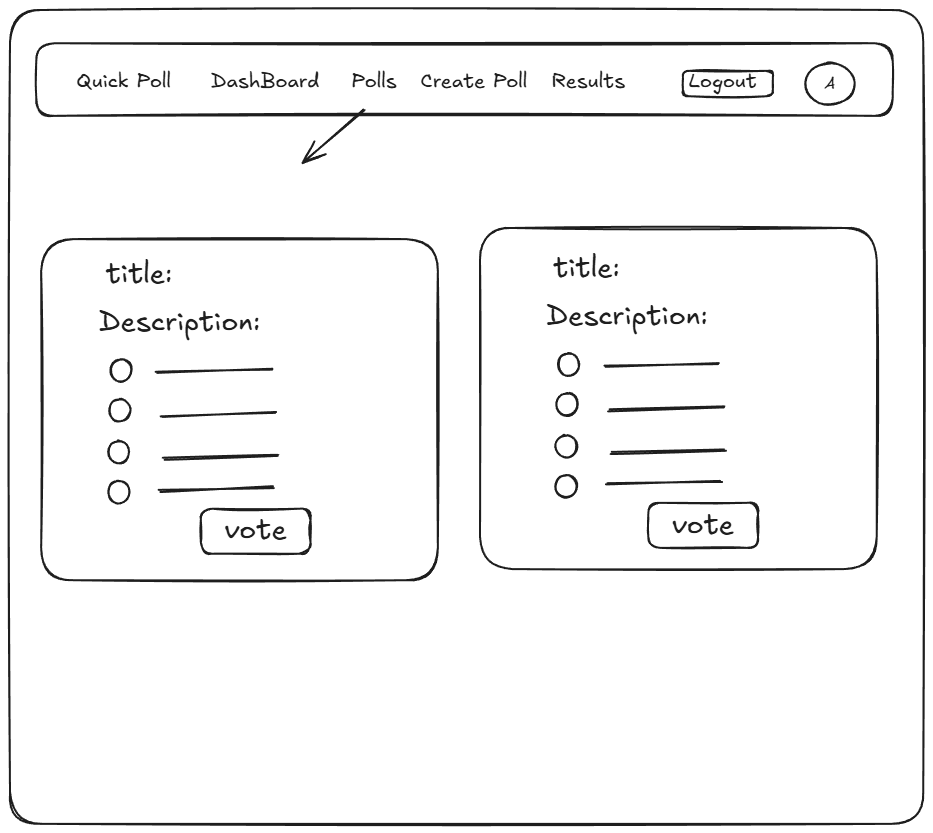
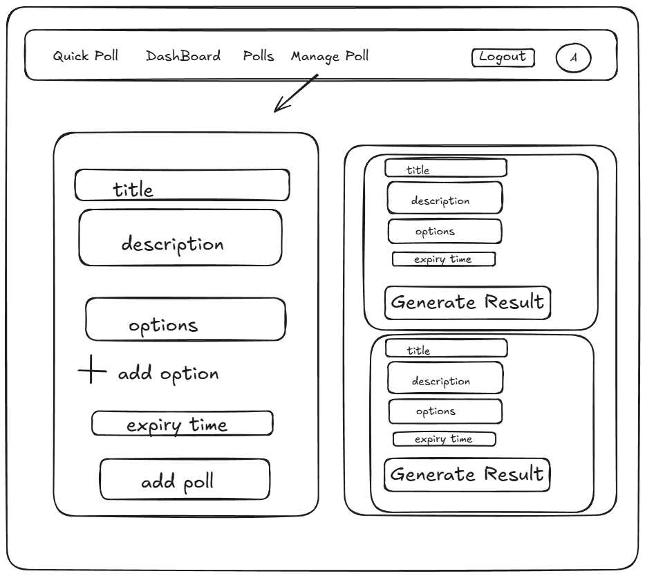
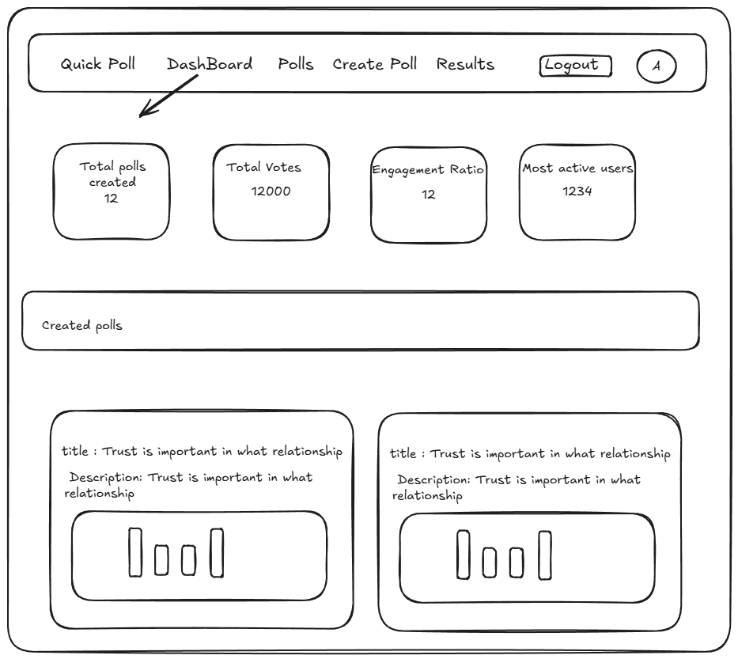
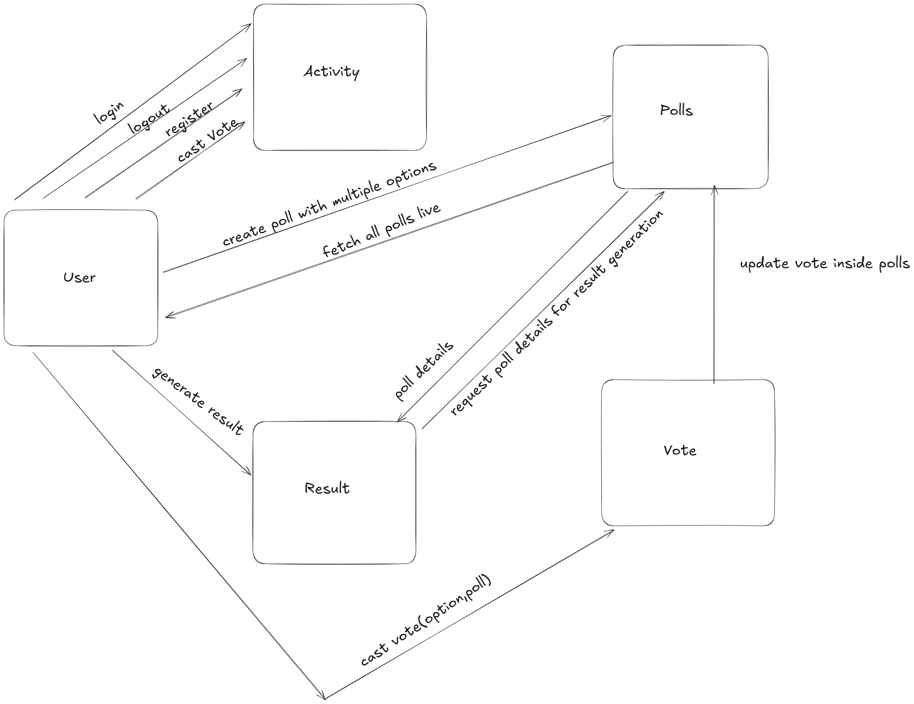

# Quick Polls Live Application

A **Quick Polling platform** where users can **create polls** , **cast vote**, and **view real-time results**

---

## Technology Stack
| Layer | Technology |
|-------|------------|
|**Frontend** | ReactJS , Tailwind CSS , Zustand (Global State management),Socket-IO-Client |
|**Backend** | NodeJS, ExpressJS |
|**Database** | MongoDB (Mongoose) |
|**Authendication** | JWT (JSON Web Token) |
|**Real-Time-Communication**| Socket.IO |

## Key Features

-**User Authentication**
    - Register and Login with secure JWT-based authendication
    - Protected routes for authorized users only

-**Poll management**
    -  Polls
    - Add multiple voting options
    - Set expiry date/time for each poll

-**Voting System**
    - Each user can vote only once per poll
    - Real-time result updates with Socket IO

-**Dashboard**
    - View Poll results live in dashboard

---

## API Design

| Module | Endpoint | Method | Description |
|--------|----------|--------|-------------|
| Auth | /api/auth/register | POST | Register a new user |
| | /api/auth/login | POST |  Login new user |
| | /api/auth/logout | POST | Logout user |
| | /api/auth/check | POST | Check auth on mount to authendicate user |
| Polls | /api/polls/getAll | GET | Get all polls created in the application |
|  | /api/polls/getPolls | GET | Get all polls created by a specific user in the application |
|  | /api/polls/generateResult/:id | POST | Generate result of a poll created by a user |
|  | /api/polls/create | POST | Create a poll |
| Vote | /api/vote/cast | POST | Cast Vote in a poll |

## UI Design

  
  
  

---

## Archiecture Flow of the project

  

## Key Challenges faced

 **Poll expiry logic** - Implementing backend validation for poll expiry 

 **Vote Unique** - To maintain uniqueness of vote in a poll

## Future enhancements 

**Poll Categories , Filters and Search** - Implementing filter and search functionality in polls

**Moderator and Admin** - For modest platform implement moderator and admin for removing inappropriate polls

**Caching** - Using Redis cache for frequently accessed polls

